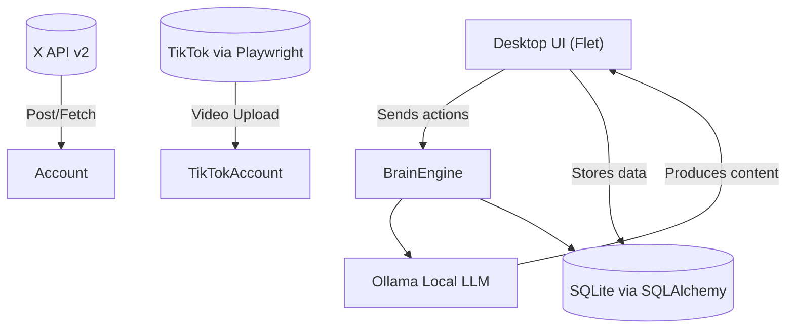

# You2.0 Social Brain (Part 1: Foundation)

This Part 1 baseline bootstraps a local-first cross-platform desktop app that runs entirely on your machine. It uses Ollama as the local brain, SQLite for persistence, and a minimal UI to manage accounts, learn your style, and generate posts. It is designed to be extended in Part 2/3 to complete TikTok posting, full history scraping, scheduling, and a polished brain orchestration.

Mermaid architecture diagram (high level):

This diagram shows the core data and action flow: the UI drives the brain, the brain uses Ollama to generate content, data is persisted locally, and platform connectors can post content when credentials are available.

Key Non-Negotiables Kept
- 100% local: no cloud LLMs; Ollama is the only external local dependency.
- Cross-platform desktop: Python 3.12+ with Flet for UI.
- Local storage: SQLite via SQLAlchemy with encrypted credentials (Fernet + keyring fallback).
- Dry-run capable: API calls to X/TikTok are simulated when credentials are absent or when explicitly in dry-run mode.
- Modular: easy to extend with real posting logic and richer brain prompts.

What you get in Part 1
- Mermaid architecture diagram (in the repo README are you2 diagrams in Mermaid syntax).
- A runnable baseline app scaffold with core UI: accounts management, style learning, content generation, and a minimal dashboard.
- Ollama bridge stub that gracefully falls back to a deterministic local style if Ollama is unavailable.
- SQLite models for accounts, style profiles, posts, and scheduled posts.
- Encryption helpers for tokens/cookies using Fernet with a key management strategy.
- Minimal X and TikTok connectors that operate in safe, non-blocking dry-run mode.
- APScheduler scaffold for future scheduled posts.
- Part 2 will introduce real OAuth flows for X/TikTok, end-to-end posting, memory-driven brain with embeddings, RAG retrieval, and a production-grade scheduler.
- Detailed installation instructions and a 60-second run guide.

How to run (60 seconds)
- Install Ollama and ensure it runs locally (default port 11434).
- Install Python and dependencies: python -m pip install -r requirements.txt
- Install Playwright browsers: python -m playwright install
- Run: python -m You2Playground or python src/main.py (depending on how you start the app)

Note: This is Part 1. It intentionally provides a strong foundation with clean separation of concerns. Further parts will add end-to-end TikTok posting, real-time brain orchestration, and a richer UX.

Known limitations for Part 1
- TikTok posting uses a safe, dry-run path and is not pushing real videos unless you supply credentials and enable the real posting path in later parts.
- X posting is simulated if tokens are not present. Real posting will be added in Part 2/3.
- Ollama must be available locally for the primary brain function. The app will gracefully degrade to a heuristic if Ollama is unavailable.

If you want to customize the UI or wire up more platforms early, let me know and I can tailor the scaffolding further.

Enjoy building You2.0 Social Brain together!

"Part 1 of the journey toward a fully local, AI-powered personal content brain."
