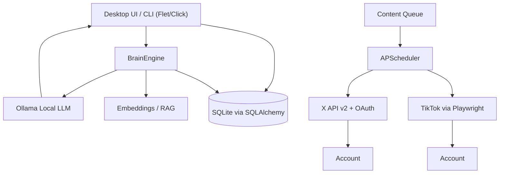

# You2.0 Social Brain

A fully local, AI-powered personal content brain for social media management. Runs entirely on your machine with Ollama as the local LLM, SQLite for persistence, and a rich desktop UI built with Flet.

## Features

- **100% Local AI Brain**: Uses Ollama (no cloud LLMs required)
- **Cross-Platform Desktop App**: Python 3.12+ with Flet UI
- **Real X/Twitter Integration**: OAuth 2.0, API v2 posting, history scraping, reply bot
- **Real TikTok Integration**: Playwright-based video upload and history scraping
- **Style Learning**: Analyzes your real posts to learn tone, topics, hashtags, and writing patterns
- **RAG Memory**: Embeddings-based retrieval of similar past posts for authentic content generation
- **Content Generation**: AI-generated posts in your authentic voice with topic/mood controls
- **Smart Scheduling**: APScheduler with real publishing to X and TikTok
- **Reply Bot**: Auto-monitors X mentions and generates replies in your voice
- **Image Generation**: Integrates with local Stable Diffusion WebUI for X image posts
- **Analytics Dashboard**: Charts for post volume, engagement metrics, and top-performing content
- **Content Queue**: Draft → Approve → Publish workflow with priority management
- **Bulk Generation**: Generate multiple posts across topics in one command
- **Cross-Posting**: Post to X and TikTok simultaneously
- **Auto-Retry**: Failed posts automatically retry with exponential backoff
- **Best Time Detection**: Analytics-driven optimal posting times
- **Full Pipeline**: Scrape → Analyze → Generate → Queue in one command
- **Secure Credential Storage**: Fernet encryption with keyring fallback
- **Full Audit Logging**: Every action tracked for transparency
- **System Tray Background**: GUI minimizes to tray and keeps posting in background
- **Comprehensive Error Handling**: Structured error logging with recovery hints, audit trail integration, and user notifications
- **Async I/O**: Non-blocking API calls with aiohttp — GUI stays responsive during generation, posting, and scraping
- **Database Migrations**: Alembic-managed schema migrations for safe upgrades
- **Input Validation & Security**: Sanitization, SQL injection guards, rate limiting, and platform-specific content limits
- **Auto-Updater**: Built-in update checker against GitHub releases
- **GUI Polish**: Content calendar, post history search/filter, keyboard shortcuts (Ctrl+1-9, Ctrl+G/P/S/H/Q), and friendly empty states
- **CLI + GUI + EXE**: Desktop app, command-line, and standalone Windows executable
- **Settings Persistence**: Settings saved to disk and survive app restarts
- **Dry-Run Mode**: Test pipelines safely without making real API calls
- **Data Export**: Export accounts, posts, and style profiles to JSON

## Architecture



## Quick Start

### Option 1: Run the Pre-built Executable (Windows)
```bash
# Build the executable with:
python pack.py

# Then run:
dist\You2SocialBrain.exe
```

### Option 2: Install via pip (recommended)

```bash
# Core only (CLI mode)
pip install -e .

# With GUI
pip install -e ".[gui]"

# With TikTok support
pip install -e ".[tiktok]"

# With X media upload support
pip install -e ".[x]"

# Everything (GUI + TikTok + X + keyring)
pip install -e ".[all]"

# Development dependencies
pip install -e ".[dev]"
```

### Option 3: Run from Source

#### Prerequisites
- Python 3.12+ (tested on 3.14)
- Ollama installed and running locally (default: http://localhost:11434)
- Playwright browsers installed (for TikTok)
- Stable Diffusion WebUI (optional, for image generation)

#### Installation
```bash
pip install -r requirements.txt
pip install -r requirements-gui.txt        # if using GUI
pip install -r requirements-tiktok.txt     # if posting to TikTok
pip install -r requirements-x.txt          # if uploading X media
playwright install
```

#### Run Desktop App
```bash
python -m src.main
```

#### Or CLI
```bash
python -m src.cli --help
```

### Setup

1. **Start Ollama** and ensure you have compatible models. The app auto-detects your installed models and will prefer:
   - **Chat/Generation**: `qwen3:8b-gpu`, `dolphin-llama3:8b-gpu` (general purpose models)
   - **Embeddings**: `qwen3:8b-gpu` or any available general model
   - **Avoids**: vision models like `llava` for text generation

   The app automatically queries Ollama and picks the best model. You can override via environment variables:
   ```bash
   set YOU2_OLLAMA_MODEL=qwen3:8b-gpu
   set YOU2_EMBEDDING_MODEL=qwen3:8b-gpu
   ```

2. **Add accounts** via the GUI or CLI:
   ```bash
   python -m src.cli add-account --platform X --username yourhandle --token YOUR_BEARER_TOKEN
   ```

3. **Scrape your history** to build style memory:
   ```bash
   python -m src.cli scrape-x --account-id 1 --max-results 100
   python -m src.cli analyze-style --account-id 1
   ```

4. **Generate and post**:
   ```bash
   python -m src.cli generate --account-id 1 --topic "machine learning"
   python -m src.cli post-x --account-id 1 "Your generated content here"
   ```

5. **Full pipeline** (scrape → analyze → generate → queue):
   ```bash
   python -m src.cli full-pipeline --account-id 1 --topic "AI news"
   ```

6. **Generate + schedule in one shot**:
   ```bash
   python -m src.cli pipeline --account-id 1 --topic "AI news" --date "2026-05-02 09:00"
   ```

7. **Dry-run everything first** (safe, no real API calls):
   ```bash
   python -m src.cli --dry-run post-x --account-id 1 "Test post"
   ```

8. **Bulk generate** multiple posts:
   ```bash
   python -m src.cli bulk-generate --account-id 1 --topics "AI,Python,DevOps" --count 3
   ```

9. **Cross-post** to X and TikTok:
   ```bash
   python -m src.cli cross-post --x-account-id 1 --tiktok-account-id 2 --video-path video.mp4 "My caption"
   ```

10. **Schedule at best time** for engagement:
    ```bash
    python -m src.cli schedule-best-time --account-id 1 "Optimal timing post"
    ```

## CLI Commands

```
add-account         Add a social media account
analyze-style       Analyze and learn writing style
best-times          Show best posting times based on engagement history
bulk-generate       Generate multiple posts across topics
cancel              Cancel a scheduled post
cross-post          Post to both X and TikTok simultaneously
delete-account      Delete an account and all its data
export-data         Export accounts, posts, and style profiles to JSON
full-pipeline       Full pipeline: scrape → analyze → generate → queue
generate            Generate a post for an account
gui                 Launch the desktop app
list-accounts       List all accounts
list-scheduled      List scheduled posts
pipeline            Full pipeline: generate content + schedule it for posting
post-tiktok         Post video to TikTok
post-x              Post to X immediately
queue-approve       Approve a draft queue item for publishing
queue-content       Generate content and add to queue as draft
queue-delete        Delete a queue item
queue-list          List content queue items
queue-publish       Publish a queued item immediately
regenerate          Regenerate a variation of existing content
reply-bot-check     Run reply bot once for an account
retry-failed        Retry failed scheduled posts and queue items
schedule            Schedule a post
schedule-best-time  Schedule a post at the optimal time for engagement
scrape-tiktok       Scrape TikTok history
scrape-x            Scrape X/Twitter history
status              Show system status (Ollama, accounts, scheduled posts)
```

Global options:
- `--debug` — Enable debug logging
- `--dry-run` — Simulate actions without making real API calls

## Content Queue Workflow

The content queue provides an approval workflow before publishing:

1. **Draft** — Content is generated and saved as draft
2. **Approved** — Review and approve drafts for publishing
3. **Queued** — Approved items ready for the worker
4. **Published** — Successfully posted
5. **Failed** — Failed after max retries

```bash
# Generate and queue as draft
python -m src.cli queue-content --account-id 1 --topic "AI news"

# List queue
python -m src.cli queue-list

# Approve
python -m src.cli queue-approve --queue-id 5

# Publish immediately
python -m src.cli queue-publish --queue-id 5

# Or let the background worker auto-publish approved items
```

## Testing

All tests run with pytest:

```bash
pytest tests/ -v
```

Current test coverage includes:
- Content generation with mocked Ollama
- OAuth flow token storage and refresh
- TikTok upload dry-run and mocks
- Scheduler scheduling and cancellation
- Content queue lifecycle (add, approve, publish, delete)
- Bulk generation across topics
- Auto-retry for failed posts
- Best time detection from analytics
- Full scrape → generate pipeline
- Cross-post scheduling
- End-to-end account lifecycle (add, generate, analyze, schedule, cancel, delete, export)
- Full pipeline command (generate + schedule)
- Dry-run mode across post commands
- Error handler safe_call utility
- Packaging smoke test

## Environment Variables

| Variable | Description | Default |
|----------|-------------|---------|
| `YOU2_OLLAMA_URL` | Ollama endpoint | `http://localhost:11434` |
| `YOU2_OLLAMA_MODEL` | Chat model | Auto-detected |
| `YOU2_EMBEDDING_MODEL` | Embedding model | Auto-detected |
| `YOU2_SD_URL` | Stable Diffusion WebUI URL | `http://localhost:7860` |
| `YOU2_X_CLIENT_ID` | X OAuth client ID | `` |
| `YOU2_X_CLIENT_SECRET` | X OAuth client secret | `` |
| `YOU2_TIKTOK_CLIENT_ID` | TikTok client ID | `` |
| `YOU2_TIKTOK_CLIENT_SECRET` | TikTok client secret | `` |
| `YOU2_DRY_RUN` | Enable dry-run mode | `0` |
| `YOU2_LOG_LEVEL` | Logging level | `INFO` |

## Database Schema

- **accounts**: Platform credentials, tokens, cookies, reply bot settings
- **style_profiles**: Learned tone, topics, hashtags, summaries
- **posts**: Full post history with engagement metrics and embeddings
- **memory_chunks**: RAG memory chunks for context retrieval
- **scheduled_posts**: Future posts with scheduling metadata
- **content_queue**: Draft/approved content queue with priorities and retry counts
- **audit_logs**: Complete action audit trail

## Feature Details

### Reply Bot (X/Twitter)
- Monitors your X mentions every N minutes (configurable)
- Generates replies in your authentic voice using your style profile
- Tracks `last_mention_id` to avoid duplicates
- Requires: X account with Bearer Token + username set
- Optional: Enable "Auto-reply" to respond without manual review

### Image Generation (X Posts)
- Generates images via local Stable Diffusion WebUI API (`/sdapi/v1/txt2img`)
- Supports custom prompts, negative prompts, CFG scale, steps
- Posts images to X via OAuth 1.0a media upload
- Requires: Stable Diffusion WebUI running + X OAuth 1.0a credentials (API Key, API Secret, Access Token, Access Token Secret)

### Analytics Dashboard
- Posts-per-day bar chart (last 14 days)
- Engagement summary: total likes, replies, retweets, averages
- Platform breakdown
- Top performing posts by engagement score
- Activity heatmap by hour of day
- Best posting time detection

## Production Notes

- All API calls are real (not simulated) when credentials are provided and dry-run is off
- TikTok posting requires valid session cookies and Playwright
- X posting supports OAuth 2.0 bearer tokens and API v2
- X image posts require OAuth 1.0a credentials (separate from OAuth 2.0 bearer token)
- The scheduler persists jobs across restarts
- Reply bot jobs also persist and run in the background
- Content queue worker can run in background (start via API or GUI)
- Failed posts auto-retry up to 3 times with exponential backoff
- Embeddings are generated via Ollama for privacy
- Credentials are encrypted at rest using Fernet
- SQLAlchemy 2.0 compatible (uses `Session.get()` instead of legacy `Query.get()`)
- Settings are persisted to `%APPDATA%/You2SocialBrain/settings.json` (Windows) or equivalent on macOS/Linux

## License

MIT
