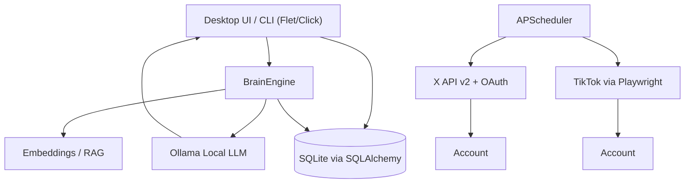

# You2.0 Social Brain

A fully local, AI-powered personal content brain for social media management. Runs entirely on your machine with Ollama as the local LLM, SQLite for persistence, and a rich desktop UI built with Flet.

## Features

- **100% Local AI Brain**: Uses Ollama (no cloud LLMs required)
- **Cross-Platform Desktop App**: Python 3.12+ with Flet UI
- **Real X/Twitter Integration**: OAuth 2.0, API v2 posting, history scraping, reply bot
- **Real TikTok Integration**: Playwright-based video upload and history scraping
- **Style Learning**: Analyzes your real posts to learn tone, topics, hashtags, and writing patterns
- **RAG Memory**: Embeddings-based retrieval of similar past posts for authentic content generation
- **Content Generation**: AI-generated posts in your authentic voice with topic/mood controls
- **Smart Scheduling**: APScheduler with real publishing to X and TikTok
- **Reply Bot**: Auto-monitors X mentions and generates replies in your voice
- **Image Generation**: Integrates with local Stable Diffusion WebUI for X image posts
- **Analytics Dashboard**: Charts for post volume, engagement metrics, and top-performing content
- **Secure Credential Storage**: Fernet encryption with keyring fallback
- **Full Audit Logging**: Every action tracked for transparency
- **CLI + GUI + EXE**: Desktop app, command-line, and standalone Windows executable

## Architecture



## Quick Start

### Option 1: Run the Pre-built Executable (Windows)
```bash
# Build the executable with:
python pack.py

# Then run:
dist\You2SocialBrain.exe
```

### Option 2: Run from Source

#### Prerequisites
- Python 3.12+ (tested on 3.14)
- Ollama installed and running locally (default: http://localhost:11434)
- Playwright browsers installed (for TikTok)
- Stable Diffusion WebUI (optional, for image generation)

#### Installation
```bash
pip install -r requirements.txt
playwright install
```

#### Run Desktop App
```bash
python -m src.main
```

#### Or CLI
```bash
python -m src.cli --help
```

### Setup

1. **Start Ollama** and ensure you have compatible models. The app auto-detects your installed models and will prefer:
   - **Chat/Generation**: `qwen3:8b-gpu`, `dolphin-llama3:8b-gpu` (general purpose models)
   - **Embeddings**: `qwen3:8b-gpu` or any available general model
   - **Avoids**: vision models like `llava` for text generation

   The app automatically queries Ollama and picks the best model. You can override via environment variables:
   ```bash
   set YOU2_OLLAMA_MODEL=qwen3:8b-gpu
   set YOU2_EMBEDDING_MODEL=qwen3:8b-gpu
   ```

2. **Add accounts** via the GUI or CLI:
   ```bash
   python -m src.cli add-account --platform X --username yourhandle --token YOUR_BEARER_TOKEN
   ```

3. **Scrape your history** to build style memory:
   ```bash
   python -m src.cli scrape-x --account-id 1 --max-results 100
   python -m src.cli analyze-style --account-id 1
   ```

4. **Generate and post**:
   ```bash
   python -m src.cli generate --account-id 1 --topic "machine learning"
   python -m src.cli post-x --account-id 1 "Your generated content here"
   ```

## Testing

All tests run with pytest:

```bash
pytest tests/ -v
```

Current test coverage includes:
- Content generation with mocked Ollama
- OAuth flow token storage and refresh
- TikTok upload dry-run and mocks
- Scheduler scheduling and cancellation
- End-to-end account lifecycle (add, generate, analyze, schedule)
- Error handler safe_call utility
- Packaging smoke test

## Environment Variables

| Variable | Description | Default |
|----------|-------------|---------|
| `YOU2_OLLAMA_URL` | Ollama endpoint | `http://localhost:11434` |
| `YOU2_OLLAMA_MODEL` | Chat model | Auto-detected |
| `YOU2_EMBEDDING_MODEL` | Embedding model | Auto-detected |
| `YOU2_SD_URL` | Stable Diffusion WebUI URL | `http://localhost:7860` |
| `YOU2_X_CLIENT_ID` | X OAuth client ID | `` |
| `YOU2_X_CLIENT_SECRET` | X OAuth client secret | `` |
| `YOU2_TIKTOK_CLIENT_ID` | TikTok client ID | `` |
| `YOU2_TIKTOK_CLIENT_SECRET` | TikTok client secret | `` |
| `YOU2_DRY_RUN` | Enable dry-run mode | `0` |
| `YOU2_LOG_LEVEL` | Logging level | `INFO` |

## Database Schema

- **accounts**: Platform credentials, tokens, cookies
- **style_profiles**: Learned tone, topics, hashtags, summaries
- **posts**: Full post history with engagement metrics and embeddings
- **memory_chunks**: RAG memory chunks for context retrieval
- **scheduled_posts**: Future posts with scheduling metadata
- **audit_logs**: Complete action audit trail

## CLI Commands

```
gui                Launch the desktop app
add-account        Add a social media account
list-accounts      List all accounts
generate           Generate a post
analyze-style      Analyze writing style
scrape-x           Scrape X/Twitter history
scrape-tiktok      Scrape TikTok history
post-x             Post to X immediately
post-tiktok        Post video to TikTok
schedule           Schedule a post
list-scheduled     List upcoming scheduled posts
```

## Feature Details

### Reply Bot (X/Twitter)
- Monitors your X mentions every N minutes (configurable)
- Generates replies in your authentic voice using your style profile
- Tracks `last_mention_id` to avoid duplicates
- Requires: X account with Bearer Token + username set
- Optional: Enable "Auto-reply" to respond without manual review

### Image Generation (X Posts)
- Generates images via local Stable Diffusion WebUI API (`/sdapi/v1/txt2img`)
- Supports custom prompts, negative prompts, CFG scale, steps
- Posts images to X via OAuth 1.0a media upload
- Requires: Stable Diffusion WebUI running + X OAuth 1.0a credentials (API Key, API Secret, Access Token, Access Token Secret)

### Analytics Dashboard
- Posts-per-day bar chart (last 14 days)
- Engagement summary: total likes, replies, retweets, averages
- Platform breakdown
- Top performing posts by engagement score
- Activity heatmap by hour of day

## Production Notes

- All API calls are real (not simulated) when credentials are provided
- TikTok posting requires valid session cookies and Playwright
- X posting supports OAuth 2.0 bearer tokens and API v2
- X image posts require OAuth 1.0a credentials (separate from OAuth 2.0 bearer token)
- The scheduler persists jobs across restarts
- Reply bot jobs also persist and run in the background
- Embeddings are generated via Ollama for privacy
- Credentials are encrypted at rest using Fernet
- SQLAlchemy 2.0 compatible (uses `Session.get()` instead of legacy `Query.get()`)

## License

MIT
